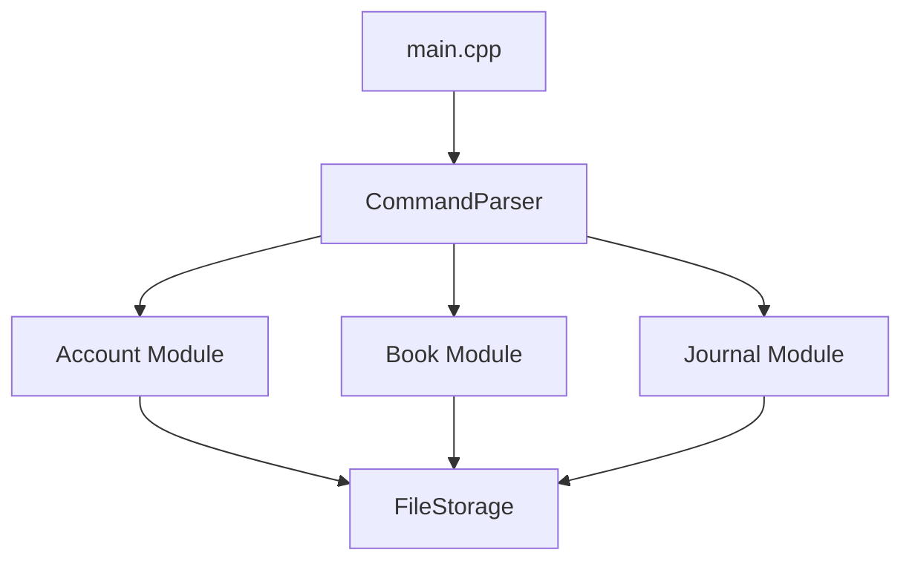

# 总体设计文档

## BookStore2024

**项目名称**：书店管理系统设计与实现

**文档作者**：卓翔

## 程序功能概述

本项目基于标准要求，设计并实现一个功能完善的书店管理系统。系统具备账户管理、图书管理、销售管理和日志系统功能，满足书店日常运营需求。程序需要记录数据到文件，支持持续的数据保存和读取。首次运行时，程序会自动执行初始化操作，创建具有超级管理员权限的默认账户。

## 主体逻辑说明

根据具体操作读取与修改各存储文件的内容，如有异常则抛出。

- **账户**：用一个登录栈维护登录用户，从`account_file`中读取账户信息并根据输入操作修改账户信息。
- **图书**：用`select_book`维护当前选中图书，根据操作读取与修改`book_file`信息。如根据书名、作者、关键字，则也打开相关文件。
- **日志**：在每次操作后记录日志信息。

## 代码文件结构

```
bookstore/
├── main.cpp                  // 程序入口
├── src/
│   ├── Data.hpp              // 各数据结构体的声明与实现
│   ├── Exception.hpp         // 异常处理类的声明与实现
│   ├── Key-Value-Database.hpp  // 文件操作类File_Storage的声明
│   ├── Key-Value-Database.cpp  // 文件操作类File_Storage的实现
│   ├── MemoryRiver.hpp         // MemoryRiver类的声明与实现
│   ├── Utils.hpp             // 一些工具的声明
│   ├── Utils.cpp             // 一些工具的实现
├── docs/
│   ├── 总体设计文档.md         // 项目总体设计文档
│   ├── 标准要求.md            // 项目标准要求文档
│   ├── 业务要求.md            // 项目业务要求文档
│   ├── 需求分析文档.md         // 项目需求分析文档
├── .gitignore                // Git 忽略文件配置
├── README.md                 // 项目说明文件
├── bonus.md                  // Bonus说明文件
├── CMakeLists.txt            // 构建项目的 CMake 文件
```


## 功能设计

### 功能结构图



### 数据库设计

下面的每个FileStorage都包含两个文件，一个是index文件，一个是block文件，分别存储块状链表的NodeHead与NodeBody

**account**: 存储 `userid(string)`到`User_Info`的映射。

**book**:存储`ISBN(string)`到`Book_Info`的映射。

**name**:存储`book_name(string)`到`ISBN(string)`的映射。

**author**:存储`author(string)`到`ISBN(string)`的映射。

**keyword**:存储`keyword(string)`到`ISBN(string)`的映射。

**transaction**:存储`time(string)`到`Transaction_Info`的映射。

**salesman_operation**:存储`time(string)`到`Operation_Info`的映射，存储员工操作。

**operation**:存储`time(string)`到`Operation_Info`的映射，存储所有操作。

### 类与结构体设计

#### User_Info 结构体

- **功能**：保存账户信息
- **保存数据**：`userid(string)`、`password(string)`、`username(string)`、`privilege(int)`

#### Book_Info 结构体

- **功能**：保存书本信息
- **保存数据**：`ISBN(string)`、`bookname(string)`、`author(string)`、`keyword(string)`、`quantity(size_t)`、`price(double)`

#### Transaction_Info 结构体

- **功能**：保存交易信息
- **保存数据**：`time(string)`、`userid(string)`、`ISBN(string)`、`quantity(size_t)`、`total_price(double)`

#### Operation_Info 结构体

- **功能**：保存操作信息
- **保存数据**：`time(string)`、`userid(string)`、`privilege(int)`、`operation(string)`、

## 修改记录

| 版本 | 日期       | 修订人     | 修订内容 |
| ---- | ---------- | ---------- | -------- |
| V1.0 | 2024-12-21 | zxsheather | 初始版本 |
|      |            |            |          |
|      |            |            |          |
|      |            |            |          |


