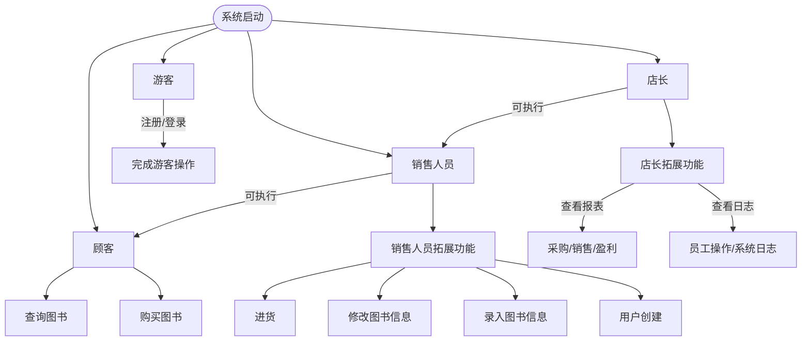
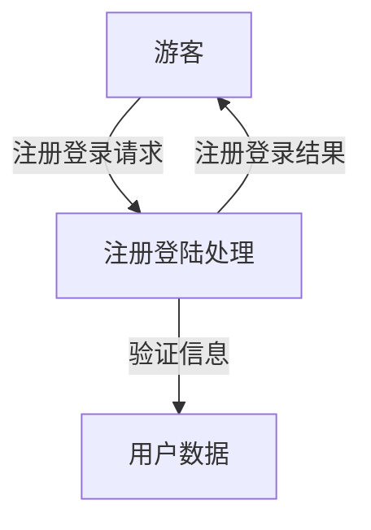
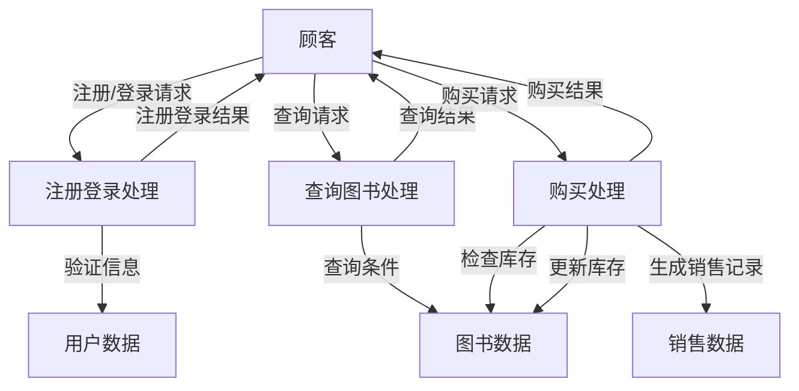
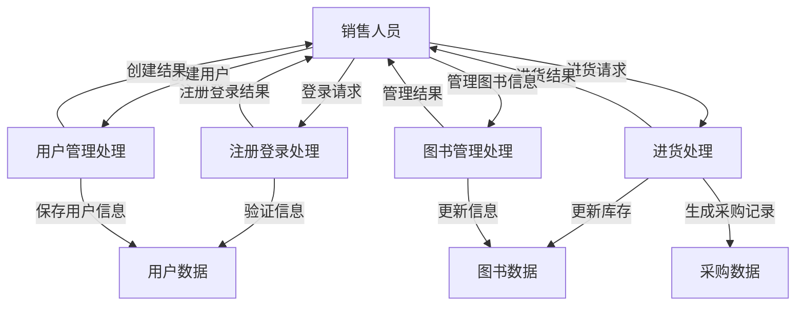
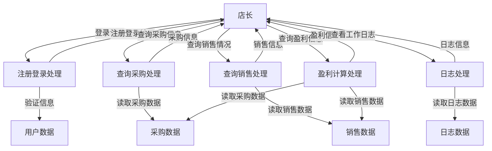

# 需求分析文档

## 1.书店管理系统业务流程图

### 概述
以下是书店管理系统的业务流程描图示，展示了系统从启动到完成各类用户操作的流程。

## 2.书店管理系统数据流图

## 概述

以下是书店管理系统的业务流程描图示，在后面的图中下一级用户均可使用前面用户的功能

## 游客数据流图

## 顾客数据流图

## 销售人员数据流图

## 店长数据流图

## 数据词典

### 用户

- **用户ID**: 用户的唯一标识符
- **用户名**: 用户的登录名
- **密码**: 用户的登录密码
- **角色**: 用户的角色（游客、顾客、销售人员、店长）

### 图书

- **ISBN号**: 图书的唯一标识符（20个字符）
- **书名**: 图书的名称（60个字符）
- **作者**: 图书的作者（60个字符）
- **关键字**: 图书的关键字（可以有多个，总共不超过60个字符）
- **库存量**: 图书的库存数量（整型）
- **单价**: 图书的单价（非负实数）

### 采购信息

- **进货ID**: 采购记录的唯一标识符
- **ISBN号**: 采购图书的ISBN号
- **数量**: 采购图书的数量
- **进货价格**: 采购图书的单价
- **进货时间**: 采购的时间

### 销售信息

- **销售ID**: 销售记录的唯一标识符
- **ISBN号**: 销售图书的ISBN号
- **数量**: 销售图书的数量
- **单价**: 销售图书的单价
- **销售时间**: 销售的时间

### 盈利信息

- **收入**: 销售图书的总收入
- **支出**: 采购图书的总支出
- **利润**: 收入减去支出后的利润

### 工作日志

- **日志ID**: 日志记录的唯一标识符

- **用户ID**: 执行操作的用户ID

- **操作类型**: 用户执行的操作类型（如创建用户、查询图书等）

- **操作对象**: 操作的具体对象（如创建的用户信息、查询的图书信息等）

- **操作时间**: 操作的时间

  ## 功能说明

  ### 游客功能

  1. **注册/登录**
     - **输入**: 用户名、密码
     - **输出**: 注册/登录结果
     - **描述**: 顾客可以通过输入用户名和密码进行注册或登录。

  ### 顾客功能

  1. **注册/登录**
     - **输入**: 用户名、密码
     - **输出**: 注册/登录结果
     - **描述**: 顾客可以通过输入用户名和密码进行注册或登录。

  2. **查询图书**
     - **输入**: 查询条件（ISBN 号、书名、作者、关键字）
     - **输出**: 图书信息列表
     - **描述**: 顾客可以根据 ISBN 号、书名、作者、关键字中的任意组合进行图书查询。

  3. **购买图书**
     - **输入**: ISBN 号、购买数量
     - **输出**: 购买结果
     - **描述**: 顾客可以通过输入 ISBN 号和购买数量进行图书购买。

  ### 销售人员功能

  1. **注册/登录**
     - **输入**: 用户名、密码
     - **输出**: 注册/登录结果
     - **描述**: 销售人员可以通过输入用户名和密码进行注册或登录。

  2. **查询图书**
     - **输入**: 查询条件（ISBN 号、书名、作者、关键字）
     - **输出**: 图书信息列表
     - **描述**: 销售人员可以根据 ISBN 号、书名、作者、关键字中的任意组合进行图书查询。

  3. **购买图书**
     - **输入**: ISBN 号、购买数量
     - **输出**: 购买结果
     - **描述**: 销售人员可以通过输入 ISBN 号和购买数量进行图书购买。

  4. **进货**
     - **输入**: ISBN 号、数量、进货价格
     - **输出**: 进货结果
     - **描述**: 销售人员可以通过输入 ISBN 号、数量和进货价格进行图书进货。

  5. **图书信息录入**
     - **输入**: ISBN 号、书名、作者、关键字、库存量、单价
     - **输出**: 录入结果
     - **描述**: 销售人员可以录入新图书的完整信息。

  6. **图书信息修改**
     - **输入**: ISBN 号、修改内容
     - **输出**: 修改结果
     - **描述**: 销售人员可以修改已有图书的信息。

  7. **用户创建**
     - **输入**: 用户名、密码、角色
     - **输出**: 创建结果
     - **描述**: 销售人员可以创建新用户。

  ### 店长功能

  1. **注册/登录**
     - **输入**: 用户名、密码
     - **输出**: 注册/登录结果
     - **描述**: 店长可以通过输入用户名和密码进行注册或登录。

  2. **查询图书**
     - **输入**: 查询条件（ISBN 号、书名、作者、关键字）
     - **输出**: 图书信息列表
     - **描述**: 店长可以根据 ISBN 号、书名、作者、关键字中的任意组合进行图书查询。

  3. **购买图书**
     - **输入**: ISBN 号、购买数量
     - **输出**: 购买结果
     - **描述**: 店长可以通过输入 ISBN 号和购买数量进行图书购买。

  4. **进货**
     - **输入**: ISBN 号、数量、进货价格
     - **输出**: 进货结果
     - **描述**: 店长可以通过输入 ISBN 号、数量和进货价格进行图书进货。

  5. **图书信息录入**
     - **输入**: ISBN 号、书名、作者、关键字、库存量、单价
     - **输出**: 录入结果
     - **描述**: 店长可以录入新图书的完整信息。

  6. **图书信息修改**
     - **输入**: ISBN 号、修改内容
     - **输出**: 修改结果
     - **描述**: 店长可以修改已有图书的信息。

  7. **用户创建**
     - **输入**: 用户名、密码、角色
     - **输出**: 创建结果
     - **描述**: 店长可以创建新用户。

  8. **查询采购信息**
     - **输入**: 时间段
     - **输出**: 采购信息列表
     - **描述**: 店长可以查询某段时间的采购信息。

  9. **查询销售情况**
     - **输入**: 时间段
     - **输出**: 销售信息列表
     - **描述**: 店长可以查询某段时间的销售情况。

  10. **查询盈利信息**
      - **输入**: 时间段
      - **输出**: 收入、支出、利润
      - **描述**: 店长可以查询某段时间的盈利信息。

  11. **查看员工工作情况报告**
      - **输入**: 员工用户名
      - **输出**: 工作情况报告
      - **描述**: 店长可以查看各员工的工作情况报告。

  12. **查看系统工作日志**
      - **输入**: 无
      - **输出**: 系统工作日志
      - **描述**: 店长可以查看系统的整体工作日志。